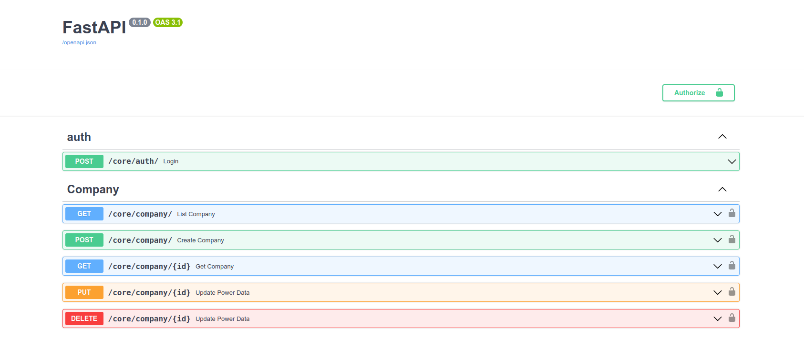
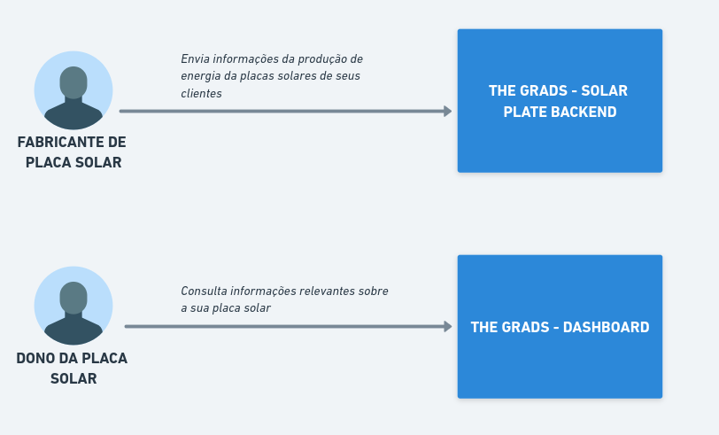
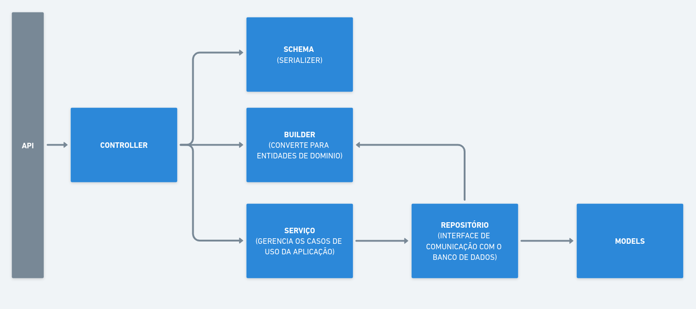

# THE GRADS - SOLAR PLATE BACKEND
Repositório do backend que está sendo desenvolvido para o projeto da equipe THE GRADS.

### Requisitos para o setup do ambiente
* [Docker](https://www.docker.com/)
* [Docker Compose](https://docs.docker.com/compose/)
* [Make](https://www.gnu.org/software/make/)


### Rodando
O projeto foi construído com [Fast API](https://fastapi.tiangolo.com/) usando o [Postgres](https://www.postgresql.org/) como banco de dados, todos os serviços estão rodando dentro de container e para rodar o projeto só é necessário executar o comando: 
```sh
make run-dev
```

Esse comando vai levantar todos os serviços necessários e será possível analisar o log da aplicação pelo terminal.

--- 
<mark>OBS: Se for a primeira vez que está rodando o projeto ao executar o comando acima, abrir um novo terminal e rodar o comando abaixo.</mark>
```sh
make reset-db
```
Esse comando irá fazer o setup correto do banco de dados e carregar os dados base do sistema

--- 

Com o sistema rodando abra a [http://localhost:5000/docs](http://localhost:5000/docs) para acessar a documentação da api, se o projeto funcionou corretamente deverá ser aberto o swagger do sistema: 


Através dele será possível relizar os testes da API.

Com execeção do Login todas as rotas exigem autenticação, o usuário padrão é o:
```
user: test@test.com
sena: password
```


### Arquitetura 
O sistema funciona como um centralizador de informações sobre as placas solares onde os produtores de placa solar podem enviar informações sobre a produtivadade de uma placa e o dono dessa placa poderá consultar informações relevantes sobre seu funcionamento.




